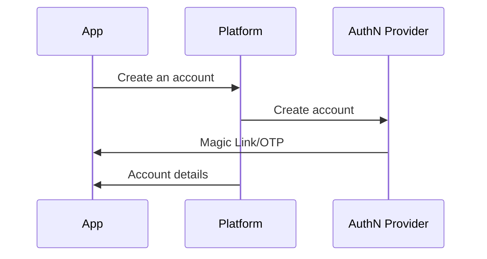
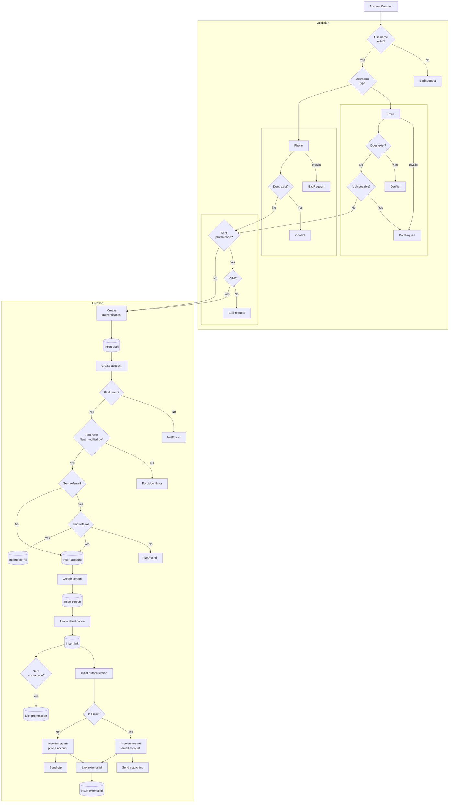

# Account Registration

## Sequence

```mermaid
sequenceDiagram
    App ->> Platform: Create an account
    Platform->>AuthN Provider: Create account
    AuthN Provider->> App: Magic Link/OTP
    Platform->> App: Account details
```

## Logic

```mermaid
graph TB
    Create[Account Creation]-->QuickCheck{Username<br>valid?}
    
    subgraph Validation
    QuickCheck-->|No| BadRequestA[BadRequest]
    QuickCheck-->|Yes| Username{Username<br>type}
    Username-->Email
    Username-->Phone  
    
    subgraph email [ ]
    Email-->|Invalid| BadRequestEmail[BadRequest]
    Email-->EmailExists{Does exist?}-->|Yes| ConflictEmail[Conflict]
    EmailExists-->|No| Disposable{Is disposable?}-->|Yes| BadRequestEmail[BadRequest]
    end

    subgraph phone [ ]
    Phone-->|Invalid| BadRequestPhone[BadRequest]
    Phone-->PhoneExists{Does exist?}-->|Yes| ConflictPhone[Conflict]
    end

    Disposable-->|No| Promo
    PhoneExists-->|No| Promo

    subgraph promocode [ ]
    Promo{Sent<br>promo code?}-->|Yes| PromoValid{Valid?}-->|No| BadRequestPromo[BadRequest]
    end

    end

    Promo-->|No| CreateAuthN
    PromoValid-->|Yes| CreateAuthN

    subgraph Creation

    CreateAuthN[Create<br>authentication]-->InsertAuthN[(Insert auth)]-->CreateAccount

    CreateAccount[Create account]-->FindTenant{Find tenant}-->|No| NotFoundTenant[NotFound]
    FindTenant-->|Yes| FindActor{Find actor<br>*last modified by*}-->|No| ForbiddenError

    FindActor-->|Yes| Referral

    Referral{Sent referral?}-->|Yes| FindReferral{Find referral}-->|No| NotFoundReferral[NotFound]

    Referral-->|No| InsertAccount[(Insert account)]
    FindReferral-->|Yes| InsertAccount & InsertReferral[(Insert referral)]
    
    InsertAccount-->CreatePerson[Create person]-->InsertPerson[(Insert person)]-->LinkAuthN[Link authentication]-->InsertAuthNLink[(Insert link)]-->InitAuth[Initial authentication]

    InsertAuthNLink-->PromoSent{Sent<br>promo code?}-->|Yes| LinkPromo[(Link promo code)]

    InitAuth-->ProviderEmail{Is Email?}-->|Yes| ProviderCreateEmail[Provider create<br>email account]

    ProviderCreateEmail-->SendMagicLink[Send magic link]
    ProviderCreateEmail-->LinkExternalId[Link external id]

    ProviderCreatePhone-->LinkExternalId
    ProviderEmail-->|No| ProviderCreatePhone[Provider create<br>phone account]-->SendOTP[Send otp]
    
    LinkExternalId-->InsertExternalId[(Insert external id)]

    end
```
